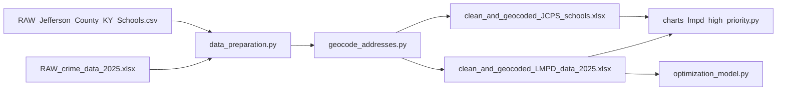

# Data-Driven Optimization of Drone Deployment for Emergency Response 

## Project Overview
Unmanned aerial systems (UAS), or drones, are increasingly used by public safety agencies to improve situational awareness and reduce emergency response times. Many U.S. cities have adopted “Drone as First Responder” programs, where drones provide real-time visual information to support police, fire, and EMS operations.

Louisville Metro Emergency Services (MetroSafe) has launched a pilot drone program using rooftop docking stations across the city. While promising, current drone placements are not consistently meeting expected response times.

This project aims to analyze the existing deployment system and develop data-driven strategies to optimize drone station locations. Using data analysis, geographic visualization, and optimization modeling, the study will evaluate how different deployment configurations impact response performance.

Conducted in collaboration with MetroSafe, this research provides hands-on experience addressing a real-world public safety challenge using large datasets and modern analytical tools.

## Research Objectives 
The project will focus on three primary objectives: 
### 1. Assess the performance of the current drone deployment system. 
Using historical incident and drone flight data, the project will analyze how the existing 
drone network performs in practice. This includes identifying patterns in incident 
locations, understanding drone utilization, and evaluating current response times. 
### 2. Develop an analytical framework to evaluate drone placement decisions. 
The project will formulate a mathematical model that represents the relationship between 
drone dock locations, incident demand, and response times. This model will allow the 
research team to systematically explore alternative deployment configurations. 
### 3. Evaluate potential deployment scenarios for improving system performance. 
Using the analytical model, the project will analyze how additional drone docking stations 
or alternative placement strategies could improve coverage and response time across 
the city. 
The results of the project will provide insights into how drone infrastructure can be strategically 
deployed to support faster and more effective emergency response. 

## What the code does (So far 6/4/2026)
1. **Prepare data**: clean raw records, normalize addresses, and geocode via the [U.S. Census Geocoder](https://geocoding.geo.census.gov/geocoder/) batch API.
2. **Explore patterns**: temporal (month, hour) and geographic (ZIP code) distribution charts for LMPD incidents and JCPS schools.
3. **Optimize coverage**: integer programming model (Gurobi) that selects up to four docks to maximize covered incidents based on drone speed and target response time.

## Repository structure

```
MetroSafe-UofL_Drone_Optimization/
├── data/                          # Raw data and temporary geocoding artifacts
│   ├── RAW_crime_data_2025.xlsx   # LMPD incidents (required)
│   ├── RAW_Jefferson_County_KY_Schools.csv
│   └── Dataflights.xlsx           # Documented flights/incidents (separate analysis)
├── output/                        # Generated outputs (gitignored)
│   ├── clean_and_geocoded_LMPD_data_2025.xlsx
│   ├── clean_and_geocoded_JCPS_schools.xlsx
│   ├── figures/                   # Visualization PNGs
│   └── *.html                     # Folium maps
├── src/
│   ├── data_preparation.py        # LMPD/JCPS cleaning + geocoding pipeline
│   ├── geocode_addresses.py       # Census geocoding (reusable)
│   ├── docks_and_incidents.py     # Dock/Incident models and coverage function
│   ├── optimization_model.py      # Coverage maximization (Gurobi)
│   └── analysis_dataflights_document.py
├── visualizations/
│   ├── charts_lmpd_high_priority.py
│   └── map_incidents_and_docks.py
├── main.py                        # Interactive optimization menu
└── requirements.txt
```

## Requirements

- **Python** 3.10+ (tested with 3.13)
- Dependencies in `requirements.txt`: `pandas`, `openpyxl`, `matplotlib`, `folium`, `plotly`, `numpy`, `requests`, `fpdf2`, `gurobipy`
- Active **Gurobi license** (academic or commercial) to run the optimization model
- Internet connection for Census geocoding (responses are saved resumably under `data/census_responses/`)

## Installation

From the project root:

```powershell
python -m venv .venv
.\.venv\Scripts\Activate.ps1
pip install -r requirements.txt
```

On macOS/Linux:

```bash
python3 -m venv .venv
source .venv/bin/activate
pip install -r requirements.txt
```

## Data sources

| File | Source / purpose |
|------|------------------|
| `data/RAW_crime_data_2025.xlsx` | Louisville Metro open data — 2025 crimes/incidents |
| `data/RAW_Jefferson_County_KY_Schools.csv` | Jefferson County schools (JCPS) |
| `data/Dataflights.xlsx` | Flight/incident log for PDF reports |

Reference portal: [Louisville Metro Open Data](https://data.louisvilleky.gov/).

Place raw files in `data/` before running pipelines. Clean, geocoded Excel outputs are written to `output/` (folder excluded from version control).

## Usage

### 1. Cleaning and geocoding (LMPD and/or JCPS)

Run the main preparation module:

```powershell
python -m src.data_preparation
```

Interactive menu: `1` = LMPD, `2` = JCPS, `3` = both.

Non-interactive (CLI):

```powershell
python -m src.data_preparation --dataset lmpd
python -m src.data_preparation --dataset jcps
python -m src.data_preparation --dataset both
```

**LMPD — key cleaning rules:**

- Removes duplicates by `incident_number`, rows without a usable address, and administrative columns.
- Normalizes block-style addresses (removes `BLOCK` from `block_address`).
- By default keeps only **High** priority incidents per NIBRS mapping (see comments in `LMPD_data_cleaning` in `src/data_preparation.py` to include Medium/Low).
- Geocodes and drops rows missing `latitude` / `longitude`.

**Outputs:**

- `output/clean_and_geocoded_LMPD_data_2025.xlsx`
- `output/clean_and_geocoded_JCPS_schools.xlsx`

Standalone geocoding (input already cleaned with `clean_address`, `clean_street`, `city`, `zip_code`):

```powershell
python -m src.geocode_addresses --input path\to\input.xlsx --output output\output.xlsx
```

### 2. LMPD and JCPS visualizations

Requires geocoded Excel files in `output/`:

```powershell
python -m visualizations.charts_lmpd_high_priority
```

Writes to `output/figures/`:

- `lmpd_distribution_by_month.png`
- `lmpd_distribution_by_hour.png`
- `lmpd_distribution_by_zipcode.png`
- `jcps_locations_by_zipcode.png` (ZIP order aligned to LMPD top 10)

### 3. Dock and incident optimization

```powershell
python main.py
```

Expected menu flow:

1. Create `Dock` and `Incident` objects from Excel files with coordinates.
2. Run `maximize_incidents_covered` (up to `DOCK_LOCATIONS_QUANTITY`).
3. Open HTML map at `output/optimized_map.html`.

**Coverage parameters** (`src/docks_and_incidents.py`):

- Drone speed: **35.8 mph** (Skydio X10 reference)
- Target response time: **2 minutes** (0.033 h)
- Effective radius: `speed × time`; coverage via approximate Euclidean distance in miles


### 4. Dataflights analysis (PDF report)

```powershell
python -m src.analysis_dataflights_document
```

Adjust the data path in the script if you use CSV instead of `data/Dataflights.xlsx`.

## Data flow (overview)


